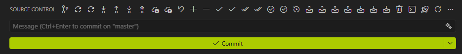

# Source Control Buttons for Visual Studio Code

Forked from: https://github.com/tomblind/scm-buttons-vscode

Add additional buttons to the source control panel. See configuration options for full list of available buttons that can be added. Note that only git actions are supported at this time.

